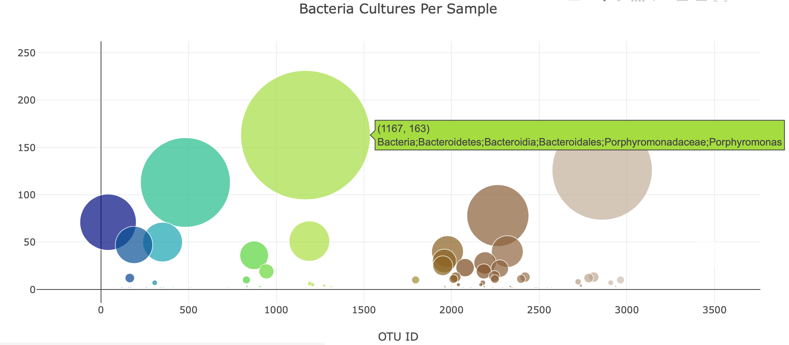

# Belly-Button-Biodiversity

## Overview of Project

In this project, we are interested in bacterial species that are capable of synthesizing proteins that taste like beef. We have a hypothesis that there is an organism that can provide the next best taste to beef and believe it can be found from the bacteria that live on human body.

### Purpose

The purpose of this project is to build a dashboard by creating engaging and dynamic charts that display the bacterial data for each volunteer by simply allowing the participants to select their ID numbers to be able to view the top ten bacterial species that live in their navels. By this way, if Improbable Beef identifies a species as a candidate to manufacture synthetic beef, these volunteers will be able to determine whether the species are found in their navel or not. As a result of this, Plotly which is a data visualization library of JavaScript is used in this case for building an interactive data visualization for the webpage by creating the following charts:

- Horizontal Bar Chart
- Bubble Chart
- Gauge Chart 

## Resources

**Documentations:** [Gauge Chart in JavaScript](https://plotly.com/javascript/gauge-charts/), [Layout Object](https://plotly.com/python-api-reference/generated/plotly.graph_objects.Layout.html).

## Results

This section of the project focuses on the results achieved using knowledge of JavaScript, Plotly, and D3.js for creating the horizontal bar, bubble and gauge charts.

**Horizontal Bar Chart**

The horizontal bar chart was created using JavaScript Plotly library which displays the top 10 bacterial species that are also known as Operational Taxonomic Units or OTUs, when an individual's ID is chosen from the dropdown menu on the webpage. As it can be seen in the figure below, the horizontal bar chart displays the **sample_values** as the values on the x-axis, and the **otu_id** as the labels.

**Bubble Chart**

The bubble chart was created using knowledge of JavaScript, Plotly and D3.js which illustrates the concentration of the samples and bacterial biodiversity. As it can further be seen in the figure below, the x-axis values of the chart displays the **otu_id** and the y-axis values demonstrates the **sample_values**. Additionally, the marker size is changing with respect to the **sample_values**. 

**Gauge Chart**

Lastly, the gauge chart was created as depicted in the figure below. As it can further be seen, the gauge chart displays the weekly washing frequency's value as a measure from 0-10 on the progress bar when an individual ID is selected from the drop down menu.

## Summary

In conclusion, the dashboard was completed successfully by adding dynamic charts which helps the volunteers who are interested in selling their bacteria to Improbable Beef to visualize and explore the types of bacteria that colonize their belly buttons. Additionally, using knowledge of HTML and Bootstrap, the dashboard was further customized by adding the following:

- An image was added to the jumbotron.
- Variety of compatible colors were added to the webpage.
- Custom font was used for text added to the webpage.
- Additional information about the project was added as a paragraph on the page.
- Additional information about what each chart visualizes was added under each graph.

The customized dashboard is illustrated in the figure below which can be viewed in the Github pages through the following URL: [Deployed Belly Button Biodiversity](https://taravatsh.github.io/Belly-Button-Biodiversity/).

